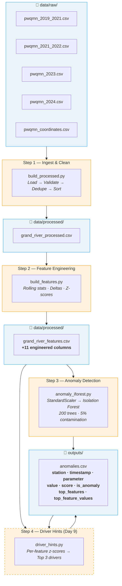
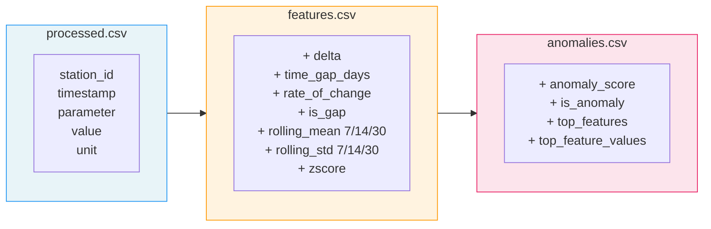

# ML Pipeline — Data Flow

```mermaid
flowchart TD
    subgraph RAW["📂 data/raw/"]
        R1[pwqmn_2019_2021.csv]
        R2[pwqmn_2021_2022.csv]
        R3[pwqmn_2023.csv]
        R4[pwqmn_2024.csv]
        R5[pwqmn_coordinates.csv]
    end

    subgraph INGEST["Step 1 — Ingest & Clean"]
        I1["build_processed.py<br/><i>Load → Validate → Dedupe → Sort</i>"]
    end

    subgraph PROCESSED["📂 data/processed/"]
        P1[grand_river_processed.csv]
    end

    subgraph FEATURES["Step 2 — Feature Engineering"]
        F1["build_features.py<br/><i>Rolling stats · Deltas · Z-scores</i>"]
    end

    subgraph FEAT_OUT["📂 data/processed/"]
        FO1[grand_river_features.csv<br/><b>+11 engineered columns</b>]
    end

    subgraph ANOMALY["Step 3 — Anomaly Detection"]
        A1["anomaly_iforest.py<br/><i>StandardScaler → Isolation Forest<br/>200 trees · 5% contamination</i>"]
    end

    subgraph DRIVER["Step 4 — Driver Hints (Day 9)"]
        D1["driver_hints.py<br/><i>Per-feature z-scores → Top 3 drivers</i>"]
    end

    subgraph OUTPUT["📂 outputs/"]
        O1["anomalies.csv<br/><b>station · timestamp · parameter<br/>value · score · is_anomaly<br/>top_features · top_feature_values</b>"]
    end

    RAW --> INGEST
    INGEST --> PROCESSED
    PROCESSED --> FEATURES
    FEATURES --> FEAT_OUT
    FEAT_OUT --> ANOMALY
    ANOMALY --> OUTPUT
    FEAT_OUT --> DRIVER
    OUTPUT --> DRIVER
    DRIVER --> OUTPUT

    style RAW fill:#e8f4f8,stroke:#2196F3
    style PROCESSED fill:#e8f4f8,stroke:#2196F3
    style FEAT_OUT fill:#e8f4f8,stroke:#2196F3
    style OUTPUT fill:#e8f4f8,stroke:#2196F3
    style INGEST fill:#fff3e0,stroke:#FF9800
    style FEATURES fill:#fff3e0,stroke:#FF9800
    style ANOMALY fill:#fff3e0,stroke:#FF9800
    style DRIVER fill:#fff3e0,stroke:#FF9800,stroke-dasharray: 5 5
```

## Column Progression

```mermaid
flowchart LR
    subgraph STEP1["processed.csv"]
        C1["station_id<br/>timestamp<br/>parameter<br/>value<br/>unit"]
    end

    subgraph STEP2["features.csv"]
        C2["+ delta<br/>+ time_gap_days<br/>+ rate_of_change<br/>+ is_gap<br/>+ rolling_mean 7/14/30<br/>+ rolling_std 7/14/30<br/>+ zscore"]
    end

    subgraph STEP3["anomalies.csv"]
        C3["+ anomaly_score<br/>+ is_anomaly<br/>+ top_features<br/>+ top_feature_values"]
    end

    STEP1 --> STEP2 --> STEP3

    style STEP1 fill:#e8f4f8,stroke:#2196F3
    style STEP2 fill:#fff3e0,stroke:#FF9800
    style STEP3 fill:#fce4ec,stroke:#E91E63
```
